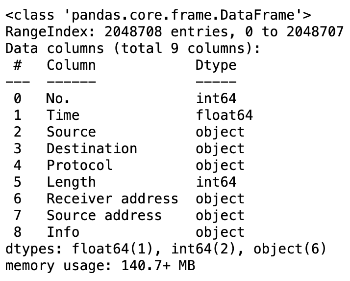

### Network Activity Fingerprint

**Stefano Costa**

#### Executive summary

I have captured network activity in my household using a network adapter in monitor mode. Network activity between a device and your wifi router is encrypted, however with a known wifi password and a [deauth technique](https://en.wikipedia.org/wiki/Wi-Fi_deauthentication_attack) it is possible to capture the encryption handshake and then decrypt all network activity. While the contents of the network packets are still encrypted, the source and destination are visible. This is the same data your ISP or VPN can see. Given the network activity of two users on four devices (one macbook and one iphone each), this project will be attempting to determine which user is which solely based on their internet activity.

#### Rationale

The ability to fingerprint an individual based on their network activity is something law enforcement can use to track people on the internet. Additionally, ISPs and businesses are collecting this data and selling it to both law enforcement and advertisement companies. This will be a proof of concept on how easy it is to gather this data and identify individuals.

#### Research Question
Can I successfully train an AI model that can strongly distinguish between two individuals on four separate devices using only their encrypted TCP network activity?

#### Data Sources
Using the airmon-ng network attack libraries I setup a network adapter in monitor mode and capture all the data in my own household.

#### Methodology
- Capture the data with [Aircrack-ng](https://www.aircrack-ng.org/doku.php?id=airmon-ng) over several days. (Collecting up to a month, I only have several days worth at the moment)

- Insert the data into Wireshark and filter it for our four devices' MAC addresses (unique network adapter numbers).

- Decrypt the the handshakes and the data again on Wireshark.

- Export the data to CSV and import the 760,000 rows into Pandas.

- Obfuscate the MAC addresses for privacy reasons.

- Define our four devices' MAC addresses so we can filter for them by person. We create a column called Person which is either 'Person1' or 'Person2' depending on the MAC address. This is the field we want to have our model predict.

- Since the network activity is a back and forth processes then the Source and Destination contain our Domain and MAC addresses in both columns. We use this information to filter out the domains and create a new feature column called Domain with this info.

- Some of the domains overlap such as "fbcdn" and "facebook" are both Facebook. We simplify most of the domains and go from ~800 unique domains to ~300.

- After creating a boxplot of the frequencies of the domains, we then remove domains that have a standard deviation over 2 away from the mean. This might need to be improved further as the boxplot is still not great but removing too much info is bad for our model.

- We OneHotEncode our Domains column and drop many useless columns such as Protocol and Time.

- We plug our data into a StandardScaler Pipeline with GridSearchCV using SVC.

#### Results

Our SVC Train Score was ~95%, our SVC Test Score was also ~95%. Our best parameters are {'svc__coef0': 0, 'svc__gamma': 0.1, 'svc__kernel': 'sigmoid'}. 

It turns out it is very easy to determine between only two different people. However, scaling this up to many many people should prove a lot more technically challenging.

#### Outline of project

- [Link to notebook 1](https://github.com/Charm-q/AI-Capstone/blob/main/Capstone%20-%20Network%20Activity%20Fingerprint.ipynb)
- [Code for the deauth and data collection script](https://github.com/Charm-q/AI-Capstone/blob/main/month-capture.sh)

##### Contact and Further Information
